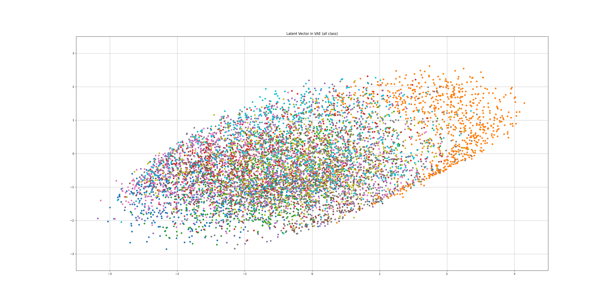
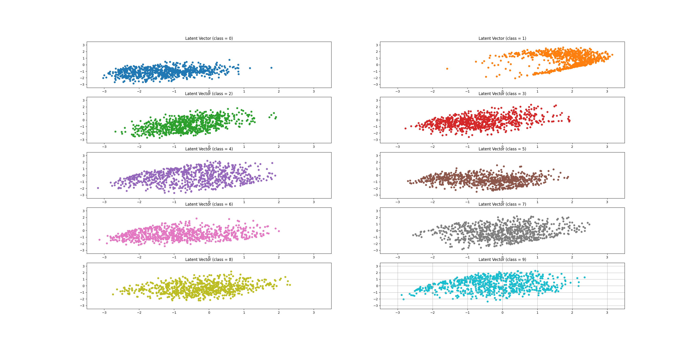
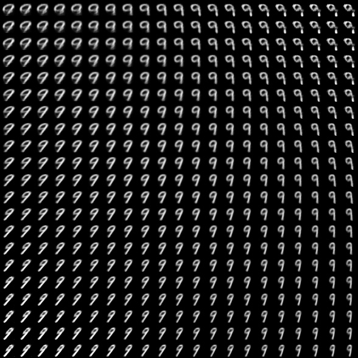

# Conditional Variatinal Auto Encoder

url : https://www.youtube.com/watch?v=rNh2CrTFpm4&t=2321s (오토인코더의 모든 것2, 이활석 박사)

## Result

* Conditional Variational Auto Encoder의 Latent vector 분포
  * 모든 class를 한번에 좌표계에 표시
    

      
    

  * 각각의 class를 따로 좌표계에 표시
    

      
    

각각의 클래스 모두가 normal distribution을 따름 

* y(class)를 고정시켜놓고 z를 변화시켜가며 확인
  * 순서대로 y가 0 ~ 9 일 때의 출력
    

      
      
      
    

    

      
      
      
    

    

      
      
      
    

    

      
    

z의 두 차원이 의미하는 특징을 확인할 수 있음.
